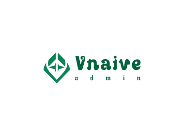

<div align="center"> <a href="https://github.com/vzane0904/v-naive-admin">  </a> <br> <br>

<p align="center">
    <a href="https://github.com/vuejs/core">
        
    </a>
    <a href="https://www.naiveui.com/zh-CN/light">
        
    </a>
        <a href="https://github.com/vuejs/pinia">
        
    </a>
    <a href="https://github.com/vitejs/vite">
        
    </a>
    <a href="https://github.com/nuysoft/Mock">
        
    </a>
  	<a href="https://github.com/vzane0904/v-naive-admin/blob/master/LICENSE">
        
    </a>
</p>
<h1>V Naive Admin</h1>
</div>

**中文** | [English](./README.md)

## 简介

V-Naive-Admin 是一个免费开源的中后台模版,使用了最新的`vue3 Vite3 TypeScript`等主流技术开发，开箱即用的中后台前端解决方案，本人是第一次写开源项目，也处于一个学习阶段，代码可能写的不太优雅，如果您对我的代码有更好的建议也希望您能提出宝贵的一键，我会虚心去学习 谢谢.

## 安全

[](https://www.murphysec.com/dr/dplIyp3BOCug5k7RuF)

我们已接入 [oscs 墨菲安全扫描](https://www.murphysec.com/dr/dplIyp3BOCug5k7RuF) ，admin 源码中未被扫描出任何风险项，超越 100%的项目，确保人畜无害！大家可以放心使用，当然您如果扔不放心，我们推荐您在使用前 clone admin 源码亲自阅读一番，我们是 100%开源，是否有风险您一看便知.

## 特性

- 🎉 **最新技术栈**：使用 Vue3/Vite3 等前端前沿技术开发
- 🎉 **TypeScript**: 应用程序级 JavaScript 的语言
- 🎉 **组件** (正在开发) 二次封装多个常用的组件
- 🎉 **权限** 内置多种动态路由权限生成方案
- 🎉 **主题**：自由灵活可配置的主题
- 🎉 **国际化**：内置国际化方案
- 🎉 **Mock 数据** 内置 Mock 数据方案
- 🎉 **Naive-ui** 尤大亲推的一款新 UI,完全 TypeScript 编写、组件多、主题配置方便、使用自由
- 🎉 **Pinia** Pinia 是 Vue 的存储库，与 Vuex 功能相同，在使用方便比 Vuex 更舒服，代码提示让你爱不释手
- 🎉 **axios** 易用、简洁且高效的 http 库
- 🎉 **Eslint** 内置代码开发规范,解决多人开发之间书写风格不一致问题

## 在线预览

- [V-Naive-Admin](https://www.mmxxn.cn/) - 完整版中文站点

测试账号: Admin / Pass123456!

## 已完成

✅ 具备后台管理系统基本功能

✅ eslint husky prettier stylelint cz-customizable

✅ 三种常用的路由模式 ROLE / BACK / MOVE

✅ (Dark / Light)主题 / 系统主题 / 顶栏主题 / 菜单主题

✅ 自动引入大部分 ui 组件 / 自定义全局(src/components/\*\*)组件 Icon / 插件 Api. 减少 import 次数

✅ 二次封装 axios 使用更简单 新增多种功能助力开发 [查看 README](./src/http/README.md)

✅ 支持 Mock 数据 不依赖后端

✅ Pinia 好不好用体验了才知道 (偷偷告诉你贼爽 🤭)

## 待完成

🔳 admin 文档

🔳 update Vite3

🔳 Vue Router keepAlive

🔳 Vue Router 动画

🔳 可视化 Vue Router 配置

🔳 封装常用组件

🔳 Vue-i18n 项目已完成插件配置，未完成变编译

😭 Bug 肯定是少不了的呀

🟡 待补充...

# 使用 Gitpod

在 Gitpod（适用于 GitHub 的免费在线开发环境）中打开项目，并立即开始编码.

[](https://gitpod.io/#https://github.com/vzane0904/v-naive-admin)

# 文档

[文档地址](http://doc.mmxxn.cn/)

## 准备

- [node](http://nodejs.org/)-[git](https://git-scm.com/)-[pnpm](https://pnpm.io/) -项目开发环境
- [Vite](https://vitejs.dev/) - 熟悉 `vite` 特性
- [Vue3](https://v3.vuejs.org/) - 熟悉 `Vue` 基础语法
- [Pinia](https://pinia.web3doc.top/) - `Pinia` 中文文档
- [TypeScript](https://www.typescriptlang.org/) - 熟悉 `TypeScript `基本语法
- [Es6+](http://es6.ruanyifeng.com/) - 熟悉 es6 基本语法
- [Vue-Router-Next](https://next.router.vuejs.org/) - 熟悉 `vue-router` 基本使用
- [Naive UI](https://www.naiveui.com/zh-CN/light) - ui 基本使用
- [Mock.js](http://mockjs.com/) - mockjs 官网

## 安装使用

- 获取项目代码

```bash
git clone https://github.com/vzane0904/v-naive-admin.git
```

- 初始化 git commitizen

```bash
cd ./v-naive-admin

pnpm install -g commitizen
```

- 安装依赖

```bash
pnpm run bootstrap
```

- 运行

```bash
pnpm dev
```

- 打包

```bash
pnpm build
```

## 更新日志

[CHANGELOG](./CHANGELOG.zh_CN.md)

## 项目地址

- [VNaive-admin](https://github.com/vzane0904/v-naive-admin.git) - 完整版

## 如何贡献

非常欢迎你的加入！[提一个 Issue](https://github.com/vzane0904/v-naive-admin/issues/new) 或者提交一个 Pull Request.

**Pull Request:**

1. Fork 代码!
2. 创建自己的分支: `git checkout -b feat/xxxx`
3. 提交你的修改: `git commit -am 'feat(function): add xxxxx'`
4. 推送您的分支: `git push origin feat/xxxx`
5. 提交`pull request`

## Git 贡献提交规范

- 参考 [vue](https://github.com/vuejs/vue/blob/dev/.github/COMMIT_CONVENTION.md) 规范 ([Angular](https://github.com/conventional-changelog/conventional-changelog/tree/master/packages/conventional-changelog-angular))

- 使用 Git cz 代替 git commit 项目内置了 husky 在提交代码时会进行代码规范检查
- `feat` 增加新功能
- `fix` 修复问题/BUG
- `refactor` 重构
- `docs` 文档/注释
- `resou` 资源变更（新增或删除 src/assets 资源
- `style` 代码风格相关无影响运行结果的
- `perf` 优化/性能提升
- `test` 测试相关
- `build` 构建流程、外部依赖变更（如升级 npm 包、修改 webpack 配置等
- `ci` 持续集成
- `chore` 依赖更新/脚手架配置修改等
- `revert` 撤销修改

## 浏览器支持

- `Chrome >= 87`
- `Firefox >= 78`
- `Safari >= 13`
- `Edge >= 88`

支持现代浏览器, 不支持 IE

| [](http://godban.github.io/browsers-support-badges/)</br>IE | [](http://godban.github.io/browsers-support-badges/)</br>Edge | [](http://godban.github.io/browsers-support-badges/)</br>Firefox | [](http://godban.github.io/browsers-support-badges/)</br>Chrome | [](http://godban.github.io/browsers-support-badges/)</br>Safari |
| :----------------------------------------------------------------------------------------------------------------------------------------------------------------------------------------------------------------------------------------------: | :----------------------------------------------------------------------------------------------------------------------------------------------------------------------------------------------------: | :---------------------------------------------------------------------------------------------------------------------------------------------------------------------------------------------------------------: | :-----------------------------------------------------------------------------------------------------------------------------------------------------------------------------------------------------------: | :-----------------------------------------------------------------------------------------------------------------------------------------------------------------------------------------------------------: |
|                                                                                                                   not support                                                                                                                    |                                                                                            last 2 versions                                                                                             |                                                                                                  last 2 versions                                                                                                  |                                                                                                last 2 versions                                                                                                |                                                                                                last 2 versions                                                                                                |

## 相关仓库

如果这些插件对你有帮助，可以给一个 star 支持下

- [vite-plugin-mock](https://github.com/anncwb/vite-plugin-mock) - 用于本地及开发环境数据 mock
- [vite-plugin-html](https://github.com/anncwb/vite-plugin-html) - 用于 html 模版转换及压缩
- [vite-plugin-style-import](https://github.com/anncwb/vite-plugin-style-import) - 用于组件库样式按需引入
- [vite-plugin-theme](https://github.com/anncwb/vite-plugin-theme) - 用于在线切换主题色等颜色相关配置
- [vite-plugin-imagemin](https://github.com/anncwb/vite-plugin-imagemin) - 用于打包压缩图片资源
- [vite-plugin-compression](https://github.com/anncwb/vite-plugin-compression) - 用于打包输出.gz|.brotil 文件
- [vite-plugin-svg-icons](https://github.com/anncwb/vite-plugin-svg-icons) - 用于快速生成 svg 雪碧图
- [unplugin-vue-components/vite](https://github.com/antfu/unplugin-vue-components) - 自动引入插件 省去 UI 库的大量 import 语句
- [unplugin-auto-import/vite](https://github.com/antfu/unplugin-auto-import) - 自动导入插件 Api 省去 UI 库的大量 import 语句
- [rollup-plugin-visualizer](https://github.com/btd/rollup-plugin-visualizer) - rollup 打包体积分析插件

## 维护者

[@zane0904](https://github.com/zane0904)

## 交流

`V-Naive-Admin` 是完全开源免费的项目，在帮助开发者更方便地进行中大型管理系统开发，同时也提供 QQ 交流群使用问题欢迎在群内提问.

- [GitHub discussions](https://github.com/vzane0904/v-naive-admin/discussions)

- QQ 群 `暂无`

## License

[](LICENSE)

[MIT © VNaive-20222](./LICENSE)

此项目可免费用于商业用途，请遵守 MIT 协议并保留作者技术支持声明.
